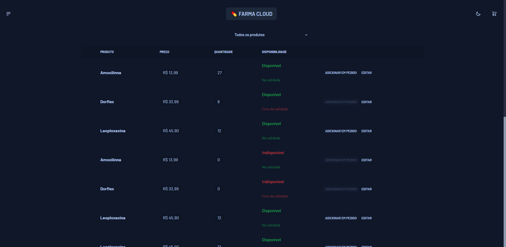
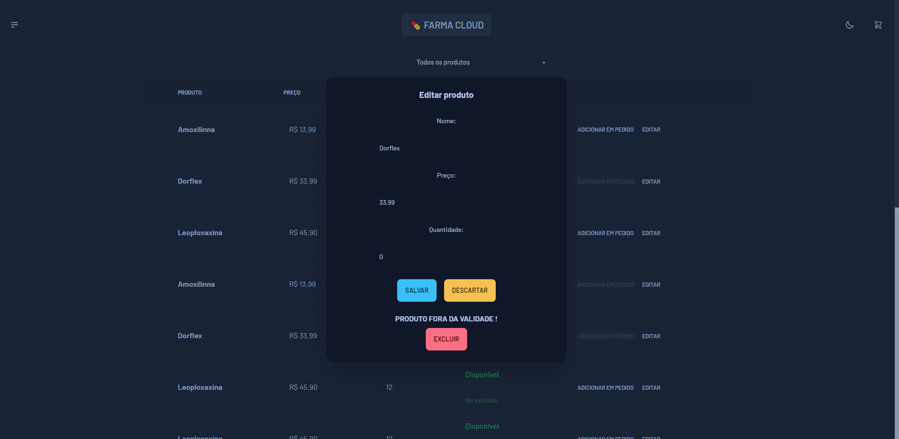
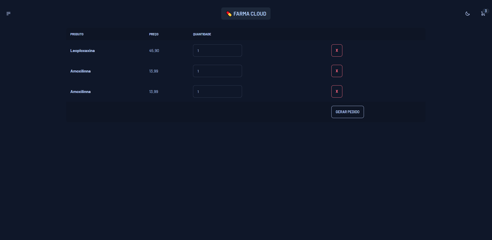
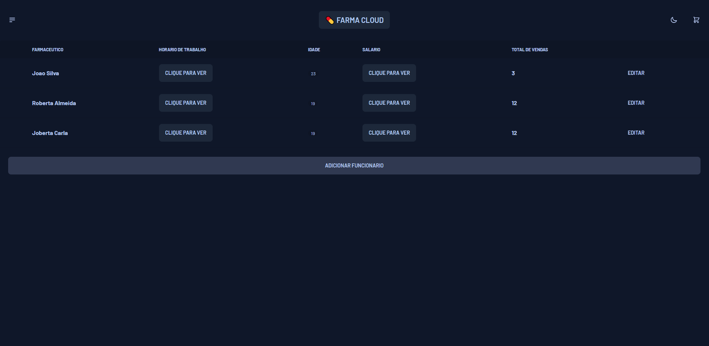
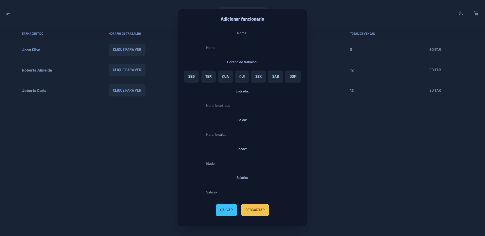
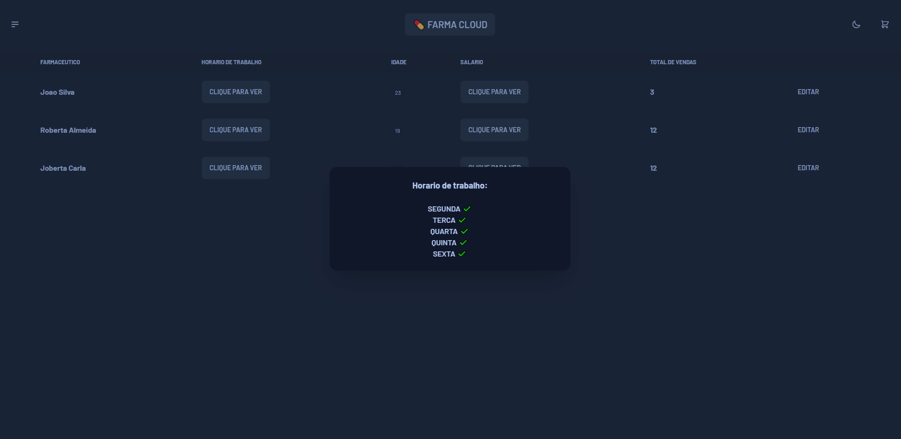
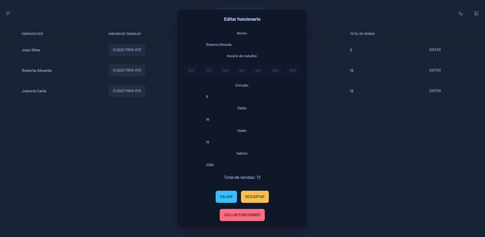
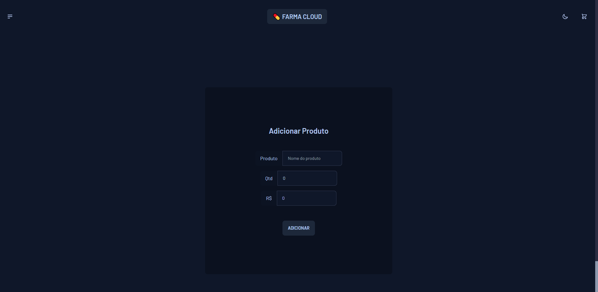

# Farma-cloud

Solução completa para gestão farmaceutica consumindo API Rest, Feito com Vite (React), TailwindCSS, DaisyUI e MerakiUI.
 

# 📸 Fotos

# 💻 O Projeto

O projeto é uma solução completa para gestão farmaceutica consumindo API Rest, Feito com Vite (React), TailwindCSS, DaisyUI e MerakiUI. Com funcionalidades de filtrar medicamentos (disponiveis, indisponiveis, fora da validade, etc), editar medicamentos, adicionar medicamentos, realização de pedido, gerenciamento de funcionario, edição e adição de funcionario e checkout para pedidos.

- TailwindCSS foi utilizado pra desenvolver a interface, trabalhando também com DaisyUI e MerakiUI;
- Json-server foi utilzado com API Rest para desenvolvimento do projeto.

# 🚀 Tecnologias

#### ✔️ ReactJS

#### ✔️ ViteJS

#### ✔️ TailwindCSS

#### ✔️ DaisyUI

#### ✔️ MerakiUI

#### ✔️ Json-server
